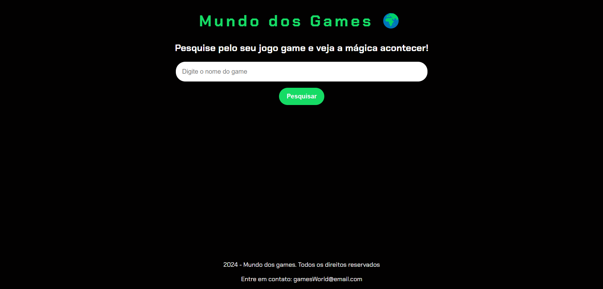

# 👨‍💻 Mundo dos Games 🌍

Esse projeto foi desenvolvido durante um evento online da Alura chamado de "Imersão Dev com Gemini", nele foi ensinado os conceitos básicos de HTML, CSS e JS para criar uma aplicação no qual o usuário consegue pesquisar sobre algum tema especifico que no caso desse projeto foi Games.

Fique a vontade para conferir esse projeto incrível clicando no link
👉 [Mundo_dos_games](https://mundo-dos-games.vercel.app/)

## 💻 Tecnologias usadas

- 🔴 HTML
- 🔵 CSS
- 🟡 JavaScript